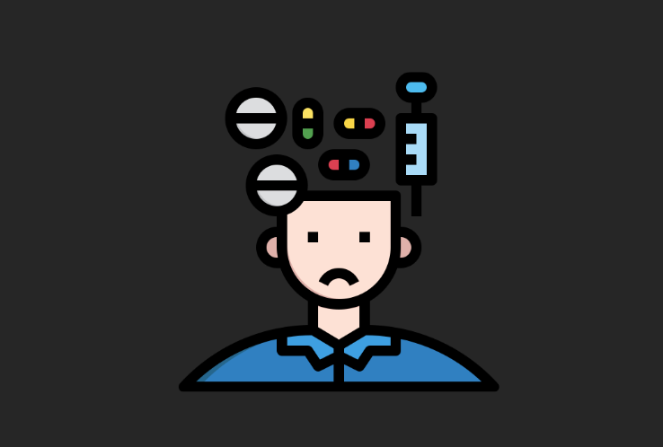
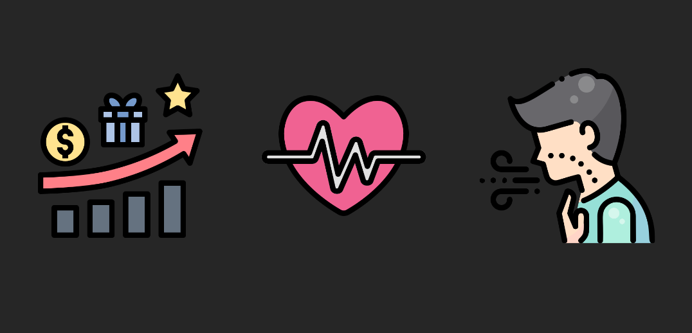
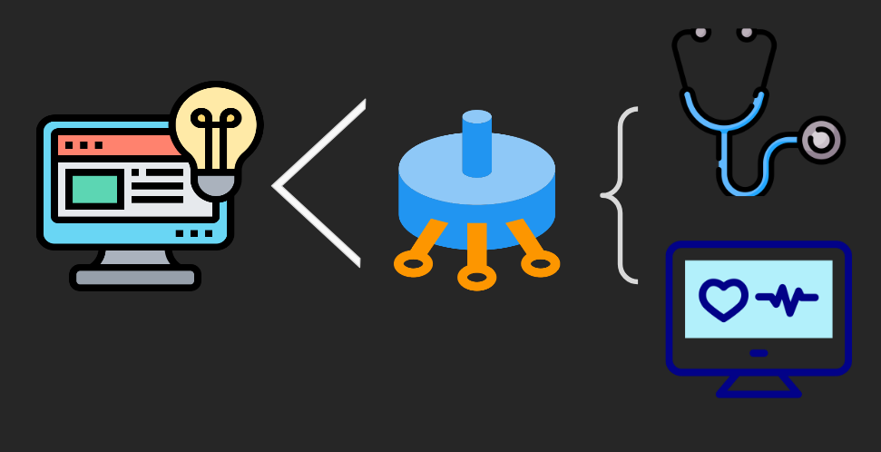
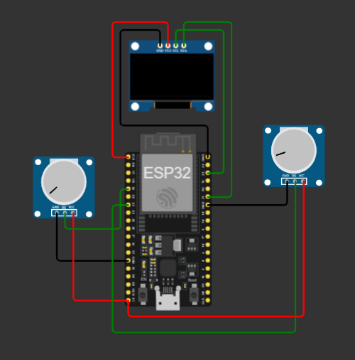
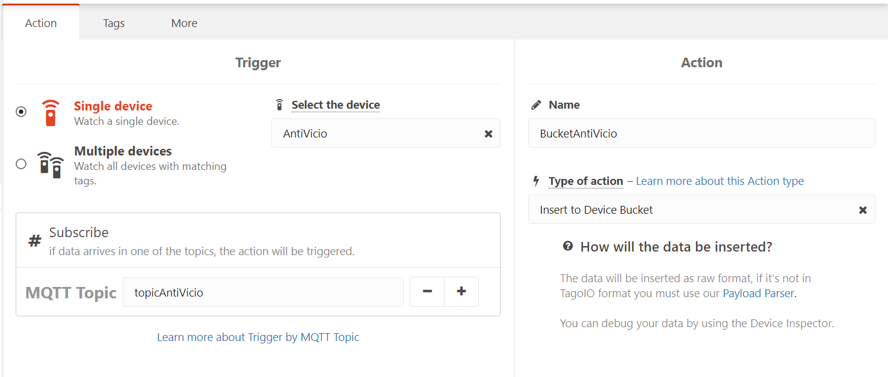
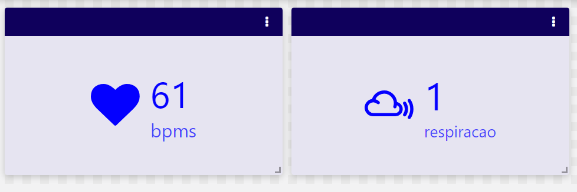
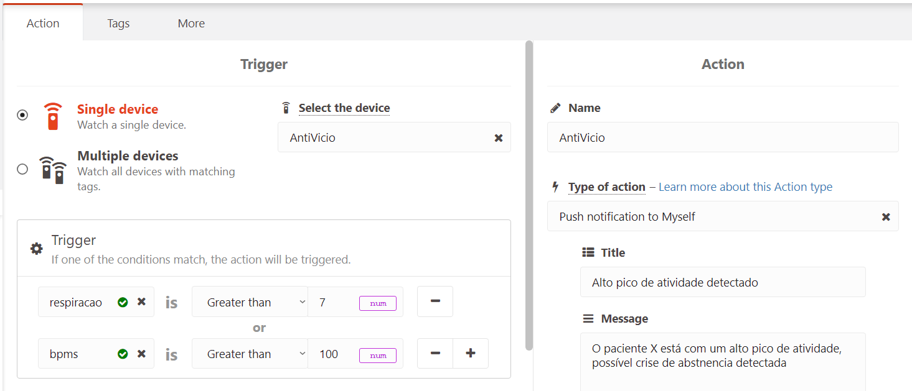
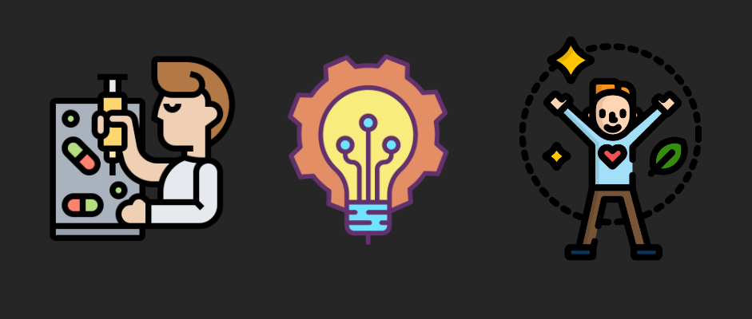

## Global Solution 2º Semestre - HapVida - Programa Anti-Vicio

**Nomes + RM dos integrantes:**
- Guilherme Akio - 98582
- Guilherme Morais - 551981

**Turma:** 1ESPW

**Ano:** 2023
___
### Descrição do Projeto - O Problema
O problema que escolhemos abordar para a Global Solution deste semestre foi a questão do vício, seja ele em drogas, bebidas alcóolicas, comidas calóricas, atitudes prejudiciais, etc. De acordo com estudos e dados de 2021 das Nações Unidas sobre Drogas e Crime (UNODC), 35 milhões de pessoas de todo o mundo sofrem transtornos resultantes do uso de drogas, e este é só um tipo de vício dentre os muitos outros existentes.

Resolvemos abordar então este problema e trazer uma solução que pudesse ajudar as pessoas a superarem seu vício, guiando-as assim para uma vida mais saudável e de mais qualidade.

  
___
### Proposta de Solução
Dentro deste tema, desenvolvemos o projeto de um programa de incentivo a não reacorrência desses vícios, e que ajudasse as pessoas a acompanharem seu progresso e sua evolução ao longo do tempo e de seu esforço.

Assimm, o programa serviria como um incentivador, ao fornecer informações importante no combate ao vício, e também como uma plataforma para acompanhamento de progresso através de metas e estatísticas pessoais.

No quesito físico da coisa, a nossa ideia foi desenvolver um bracelete para monitorar os batimentos cardíacos e frequência respiratória das pessoas, que são indicadores importantes em uma pessoa que esteja passando por um processo de abstnência, e enviar esses dados em tempo real a um profissional de saúde responsável pelo acompanhamento daquela pessoa, de modo que ele possa identificar uma possível recaída e checar o resultado do tratamento na pessoa monitorada.

  
___
### Construção com Arduino
O arduino em si não possui componentes em seu kit básico que fazem a leitura direta das variáveis mencionadas. Idealmente, sensores mais especializados seriam necessários. Par via de exemplificação então, aqui utilizamos dois potenciômetros para simular os dados fornecidos por tais sensores. 

Os valores enviados pelo potenciômetro são lidos a todo momento e, ao indicarem algum valor fora da faixa ideal (de batimentos ou respiração), o circuito prontamente exibe mensagens emergenciais em uma tela OLED para ajudar o usuário a superar essa agitação. Além disso, todos os valores lidos são enviados via protocolo MQTT para a plataforma Tago, onde podem ser analisados e compartilhados com o profissional de saúde adequado.

___
### Desenvolvimento
O projeto foi desenvolvido com base em tecnologias já existentes, mas que são utilizadas para outros fins (como SmartWatches para acompanhamento de práticas esportivas), e também uma análise do tema abordado e em quais sub-problemas poderíamos atuar. 

Para a estruturação do circuito e algorítimo, utilizamos a aplicação web [Wokwi](https://wokwi.com), e buscamos referências em outros projetos já desenvolvidos utilizando componentes, montagens e codificação semelhante. Utilizamos também o arduino, seus componentes básicos e mais alguns extras para a montagem prática do sistema.
___
### Montagem física

Para a montagem física do projeto, será necessário utilizar:
- Plataforma Wokwi (para reproduzir a simulação exibida [nesta imagem](imagens/Montagem_Fisica.png));
- Programa Arduino IDE (juntamente com o código presente [neste arquivo](codigos/Codigo_Arduino.ino) - anexa também sua [versão em txt](codigos/Codigo_Arduino.txt));
- Kit básico de componentes físicos do Arduino, detalhados abaixo:
<table align=center>
  <tr>
    <td><b>Componente</b></td>
    <td align=center><b>Quantidade</b></td>
  </tr>
    <tr>
    <td>Placa ESP32*</td>
    <td align=center>1</td>
  </tr>
    <tr>
    <td>Potenciômetro</td>
    <td align=center>2</td>
  </tr>
  <tr>
    <td>Display OLED*</td>
    <td align=center>1</td>
  </tr>
</table>

Basta agora reproduzir o [modelo do Wokwi](imagens/Montagem_Fisica.png) utilizando os combonentes físicos listados. Para execução, é necessário conectar a placa ESP32 a um computador via Micro-USB, inserir o [código de execução](codigos/Codigo_Arduino.ino)** no programa Arduino IDE e fazer o upload.

_*Atenção: A placa ESP32 e o display OLED não fazem parte do kit de componentes básicos do Arduino, e devem ser adquiridos separadamente._
_**Atenção: o código contém duas variáveis que devem ser austadas a reproduzir o projeto: YOUR_TOKEN (deve ser inserido o token do disapositivo utilizado na tago) e YOUR_TOPIC (deve ser inserido o tópico utilizado na action da Tago para recebimento de dados via MQTT, e repetido em todas as variáveis enviadas)._

___
### Configuração Tago
A configuração da plataforma Tago para receber os dados enviados pelo programa, e encaminhar para o profissional de saúde que esteja relacionado ao cuidado do usuário, é feita através de algumas etapas:
#### Action para recebimento de dados via MQTT

#### Construção de Dashboard informativo

#### Action para envio de notificação ao profissional de saúde
Esta action é a que mais pode variar de caso a caso, podendo ser desde uma notificação dentro da própria plataforma Tago, até o envio das informações por email. É necessário ajustar de acordo com a necessidade de cada caso.

___
### Pré-requisitos 
Para execução do projeto é necessário conhecimento sobre o uso da plataforma Wokwi, e experiência com o uso do programa Arduino e de seus componentes físicos. É necessário também saber usos básicos da linguagem C++ para entendimento do código e ajustes necesários.
___
### Resultados esperados e impactos:
Nosso objetivo com o projeto é fornecer um maior e mais direcionado apoio para pessoas que buscam superar um vício. Ao tornarmos esse caminhho mais fácil, estamos contribuindo não só com o bem estar físico e mental das pessoas viciadas, mas também com o de todas as pessoas ao seu redor, visto que esse é um problema que impacta também as pessoas envolvidas com os usuários.

Através de um método simples e eficiente, buscamos uma vida mais saudável para todas as pessoas, e consequencialmente um mundo melhor através da tecnologia e inovação.

___
### Links
  [Link para o vídeo explicativo do projeto no Youtube](https://youtu.be/Z2FukO58Kek)
  
  [Link para projeto completo do sistema no Wokwi](https://wokwi.com/projects/381966954468037633)
